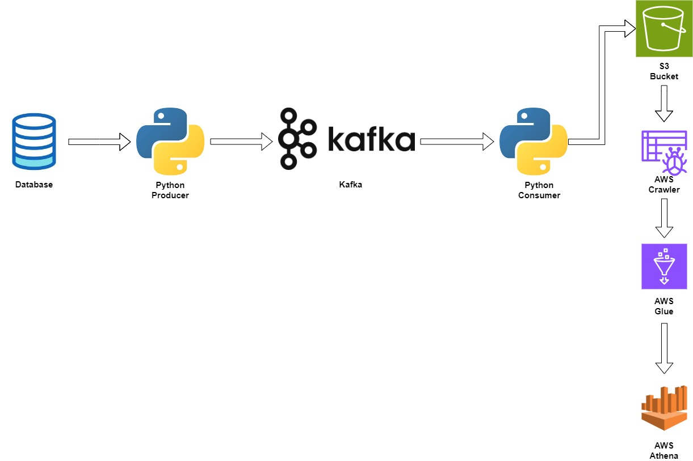

# Real-Time Data Pipeline | Stock-Market Data

## Introduction :
This project focuses on building a real-time data pipeline, leveraging Python for data extraction and Kafka for data transfer to the desired storage location. We utilize AWS Glue Catalog to organize and manage metadata, and Amazon Athena to efficiently query and analyze the data. The goal is to create a seamless and automated pipeline that ensures data is processed and available in near real-time for analysis and decision-making.

## Architecture Diagram :

## Technology Used : 
1. Programming language : Python
2. Scripting language : SQL
3. Aamazon Web Services :
	- Apache kafka
	- S3
	- Glue
	- Athena

## Dataset Used :
Stock Market Data
here we have stock-market data which have date, opening Price, High Price, Low Price, Close Price, Volume.
link of the data set - https://github.com/ASK0805/Real-Time-Data-Pipeline-For-Stock-Market-Data/blob/main/Dataset/indexData.csv

 ## Problem Statement : 
In this project, we aim to develop a data pipeline that transfers data from our source, a stock market API, to our destination, an S3 bucket. After the data is stored, we plan to perform analysis on it using SQL.

## Solution : 
### Step 1 : 
First, we develop a Python application that pulls data from the stock market API and transfers it into a Kafka topic. A consumer application, also written in Python, then reads from that topic and streams the data into the storage system.
	
### Step2 :
We use Amazon S3 as our storage system. To read data from S3 for analysis, we use an AWS Glue Crawler to catalog the data. For running SQL queries on this data, we use AWS Athena.
 
## Conclusion:
The main aim of this project is to develop a robust data pipeline that transfers data from a stock market API to an S3 bucket. This allows us to perform analysis on the data using SQL, helping customers make timely investment decisions.
